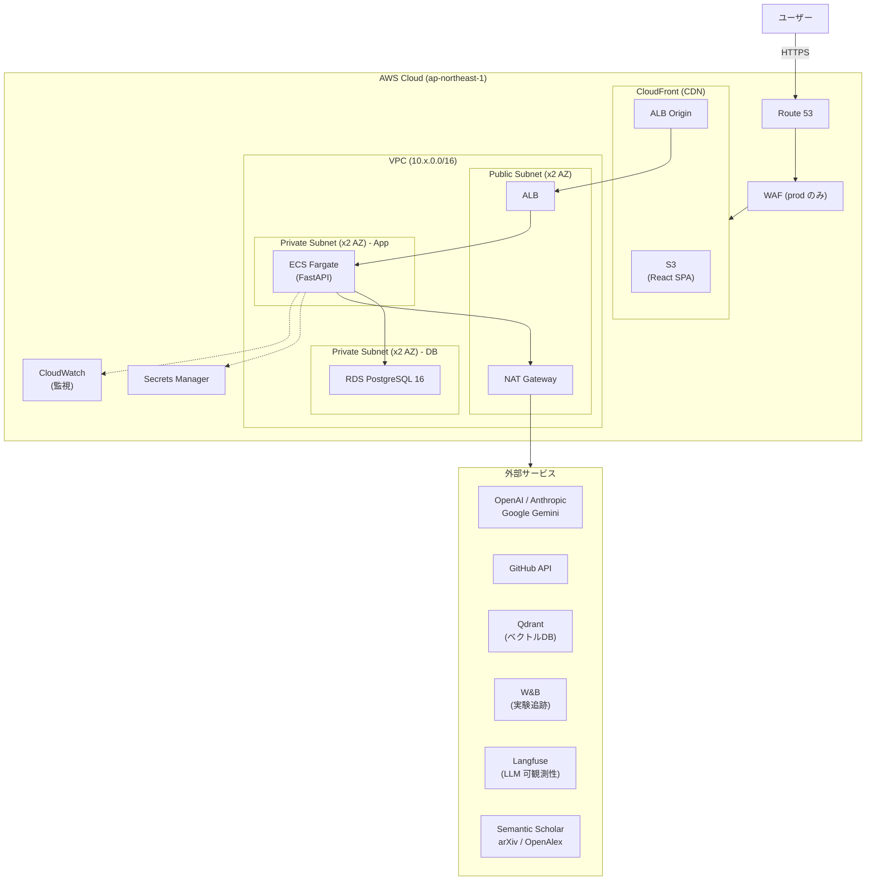
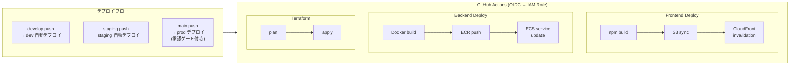

# アーキテクチャ

## 全体構成図



## リクエストフロー

```
ユーザー
  │
  ▼
Route 53 (DNS)
  │
  ▼
CloudFront (CDN + WAF)
  │
  ├── 静的コンテンツ ──▶ S3 (React SPA)
  │
  └── /api/* ──▶ ALB (HTTPS)
                  │
                  ▼
              ECS Fargate (FastAPI)
                  │
                  ▼
              RDS PostgreSQL (Private Subnet)
```

## CI/CD パイプライン



## ネットワーク設計

```
VPC (10.x.0.0/16)     ※ x = 0(dev), 1(staging), 2(prod)
│
├── Public Subnet x2 (10.x.1.0/24, 10.x.2.0/24) - 2AZ
│   ├── ALB
│   └── NAT Gateway
│
├── Private Subnet x2 (10.x.10.0/24, 10.x.11.0/24) - 2AZ
│   └── ECS Fargate (バックエンド)
│
└── Private Subnet x2 (10.x.20.0/24, 10.x.21.0/24) - 2AZ
    └── RDS PostgreSQL
```

## セキュリティグループ

| SG | インバウンド | アウトバウンド |
|---|---|---|
| ALB SG | 443 (0.0.0.0/0) | ECS SG:8000 |
| ECS Backend SG | 8000 (ALB SG) | RDS SG:5432, 443 (外部API) |
| RDS SG | 5432 (ECS Backend SG) | なし |
